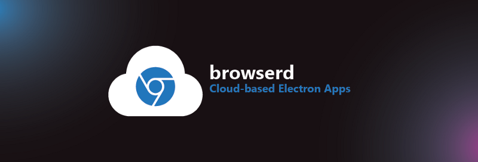

# browserd



Headless electron app platform for the cloud 🤕☁✨

[](https://sonarcloud.io/dashboard?id=bengreenier_browserd)

We needed a way to run chrome-based browser experiences inside a container, and to stream that container to remote clients using webrtc.
Browserd (named to indicate it's a browser [daemon](https://en.wikipedia.org/wiki/Daemon_(computing))) uses electron to do so.

This app is broken down into two main components the [stream-provider](components/stream-provider) which contains and provides the 'browser experiences' and the [stream-consumer](components/stream-consumer) an example of a 'remote client'. These components are supported by the [shared component](components/shared) which houses shared functionality.

## Components

### Stream-Consumer

[This simple web app](./components/stream-consumer) connects to the stream-provider through a signaling server. It receives and displays a stream from the cloud, and it can send input to the cloud.

[](https://dev.azure.com/bengreenier/browserd/_build/latest?definitionId=14&branchName=master)

### Stream-Provider

[This electron app](./components/stream-provider) connects to the stream-consumer through a signaling server. It receives input from the consumer, and streams its view to the consumer.

[](https://dev.azure.com/bengreenier/browserd/_build/latest?definitionId=11&branchName=master)

[](https://deploy.azure.com/?repository=https://github.com/bengreenier/browserd/blob/repo-restructure/components/stream-provider#/form/setup)

## Using Lerna

We use [Lerna](https://github.com/lerna/lerna) to help manage our monorepo. It links our local dependencies and it reduces redundant packages and ensures consistent versioning. To run anything locally, you will need to npm install Lerna globally. With Lerna, we can automatically install all node_modules for all components, cross link them, and move shared dependencies up to the root.
 
```
npm install -g lerna
```

## Signaling server

Our service is compatible with any standard WebRTC signaling implementation. If you need a simple one that communicates over HTTP/1.1, [webrtc-signal-http](https://github.com/bengreenier/webrtc-signal-http) is a good option.

## Configuration

Our service can be configured using a [dotenv](https://www.npmjs.com/package/dotenv) file - `.env` containing one environment variable
key and value per line. For example `KEY=value`. Below are the possible options:

+ `SERVICE_URL` (string) - the web service address (to render)
+ `TURN_URL` (string) - a turn address
+ `TURN_USERNAME` (string) - a turn username
+ `TURN_PASSWORD` (string) - a turn password credential
+ `POLL_URL` (string) - a signaling server base address
+ `POLL_INTERVAL` (number) - a signaling poll interval in ms
+ `HEIGHT` (number) - the window height
+ `WIDTH` (number) - the window width
+ `EXP_HIDE_STREAMER` (boolean) - experiment flag for hiding the streamer window
+ `TWILIO_ACCOUNT_SID` (string) - a Twilio AccountSid required to get a Network Traversal Service Token
+ `TWILIO_AUTH_TOKEN` (string) - a Twilio AuthToken required to get a Network Traversal Service Token

## Turn server

Our service supports both [coturn](https://github.com/coturn/coturn) and [Twilio's STUN/TURN service](https://www.twilio.com/docs/stun-turn).
In the dotenv file, if `TWILIO_ACCOUNT_SID` and `TWILIO_AUTH_TOKEN` values are set, our service will attempt to get a turn server from Twilio. Otherwise, you can leave them empty to use a stun server or coturn turn server.

## Electron security

Our service follows [electron security guideline](https://electronjs.org/docs/tutorial/security) and enables the following behaviors:

+ Enabling [contextIsolation](https://electronjs.org/docs/tutorial/security#3-enable-context-isolation-for-remote-content), which allows scripts running in the renderer to make changes to its javascript environment without worrying about conflicting with the scripts in the electron API or the preload script.
+ Blocking [mouse middle-clicking](https://www.blackhat.com/docs/us-17/thursday/us-17-Carettoni-Electronegativity-A-Study-Of-Electron-Security-wp.pdf), which opens a new window and makes our remote input stop working.
+ Disabling popup dialog for file downloading (when clicking on a link) so that it doesn't interfere with the streamer window.
+ Displaying warning about using [insecure http protocol](https://electronjs.org/docs/tutorial/security#1-only-load-secure-content) or when the streamer window [navigates to a new origin](https://electronjs.org/docs/tutorial/security#12-disable-or-limit-navigation), which is different from the `SERVICE_URL`.

## Running

> Note: Please refer the README of any component subdirectory for more detailed instructions.

Ensure you've installed dependencies (`npm i`) before continuing.

Follow these steps to get browserd up and running:

> Note: `npm run magic` will complete all these steps for you.

+ `npm run bootstrap` - this runs [lerna bootstrap](https://github.com/lerna/lerna/tree/master/commands/bootstrap#readme) to setup the project, installing dependencies as it goes.
+ `npm run build` - this builds all the packages needed to run.
+ `npm run start` - this starts the [`stream-provider`](./components/stream-provider). Note that it requires some [environment variable configuration](#configuration), as mentioned above.

## Contributing

Coming soon. ✨

## License

MIT
